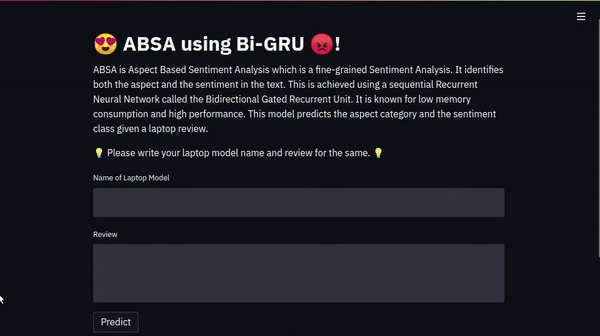

# Aspect Based Sentiment Analysis using Bidirectional Gated Recurrent Network


ABSA is Aspect Based Sentiment Analysis which is a fine-grained Sentiment Analysis. There are two fundamental components of ABSA namely Aspect Categorization and Sentiment Analysis.

## Aspect Categorization

Aspect establishment is a module where the properties of the data that will be significant for the paradigm are focused upon. Without identifying these aspects, it is hard and impossible to jump to sentimental analysis. These aspects are nouns from the perspective of parts of speech. For instance, the aspect identification in the domain twitter analysis of politics will be accountability.

## Sentiment Analysis

Sentiment classification is a module where the emotions of the data that were recognized previously are focused upon. Broadly speaking, there are numerous emotions like positive, negative and, neutral. When it’s a sentiment, nothing is black and white.


## Bidirectional Gated Recurrent Unit

[Gated Recurrent Unit](https://arxiv.org/pdf/1412.3555.pdf) is a sequential Recurrent Neural Network. As the name suggests, it has two important gates namely the update gate and the forget gate. Update gate is a gate that determines how much of the old information must be brought into a new computation. Forget gate is the second gate that determines how much of the old information must be overlooked in a new computation. It is known for low memory consumption, high performance, simpler architecture. Bidirectional networks are capable of transmitting data in both directions.


## Install Packages

Install required libraries using the following command:
```bash
$ pip install -r requirements.txt
```


## Files

- `ABSA.ipynb`: Notebook to build ABSA using Bi-GRU
- `/data`: Train and test datasets
- `/models`: Pre-trained models for inference
- `/tokenizer`: Tokenizer
- `/encoders`: Encoders for Aspect Categorization and Sentiment Analysis
- `/assets`: All images displayed on this README.md
- `model.py`: Aspect Categorization and Sentiment Analysis networks
- `absa.py`: ABSA model
- `report.pdf`: Detailed report on architecture, implementation, and comparison with other popular architectures.
- `run.py`: Streamlit app


## Train, Evaluate, and Test

Check out the notebook [ABSA.ipynb](ABSA.ipynb) to train, evaluate, and test your own model on custom datasets.


## Run Streamlit App

Use the following command to run Streamlit App:
```bash
$ streamlit run run.py

  You can now view your Streamlit app in your browser.

  Local URL: http://localhost:8501
  Network URL: http://192.168.1.4:8501

```

Check out the GIF below for a demo!


